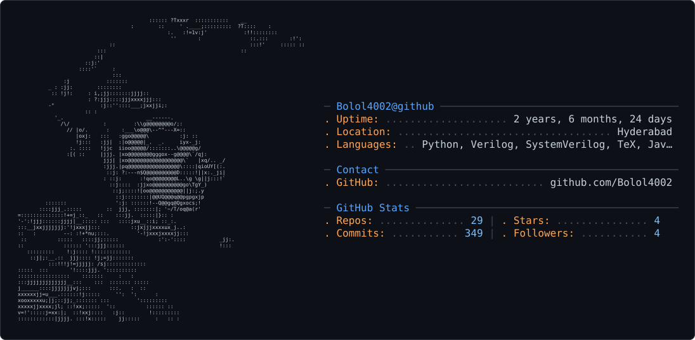

<picture>
  <source media="(prefers-color-scheme: dark)" srcset="dark_mode.svg" />
  <source media="(prefers-color-scheme: light)" srcset="light_mode.svg" />
  
</picture>

# Sayooj S

**VLSI Engineer | Systems Architect**

Electronics & Communication Engineer specializing in VLSI Design.

---

### What I do

- Digital circuit design (Verilog/SystemVerilog)
- Systems programming (C/C++, Java, Bash)
- Embedded systems (Arduino, Raspberry Pi)
- Basic ML with Python (Keras, Matplotlib)

---

---

### Find me

- Portfolio: [bolol4002.github.io/portfolio](https://bolol4002.github.io/portfolio/)
- LinkedIn: [Sayooj S](https://linkedin.com/in/sayooj-s-7a8580285)
- X: [@SayoojS1112](https://x.com/SayoojS1112)
- Email: sayoojsumesh1112@gmail.com

---

> Precision in design. Elegance in execution.
